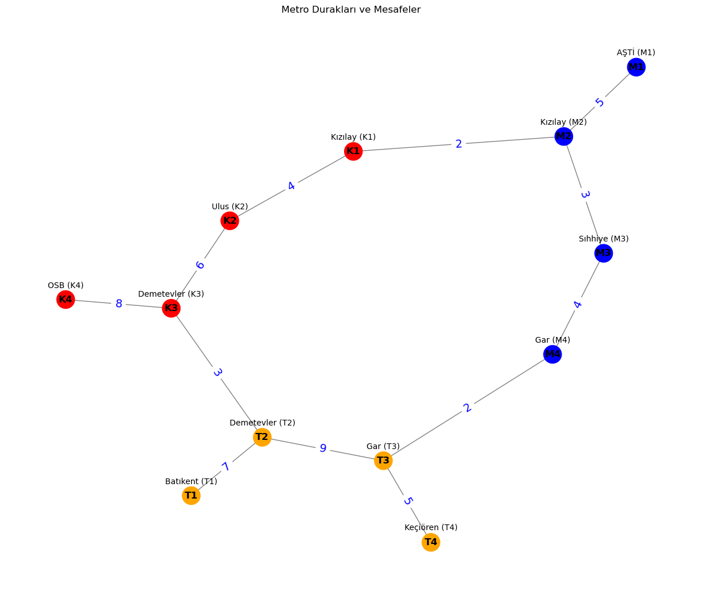

# Metro Rota Optimizasyonu - Sürücüsüz Metro Simülasyonu Projesi

## Proje Hakkında
Bu proje, bir metro ağında **en hızlı** ve **en az aktarmalı** rotayı bulan bir simülasyon oluşturmayı amaçlamaktadır.

Ekstra olarak, metro istasyonları ve mesafelerini renklendirilmiş bir grafikle görünteleme özelliği eklenmiştir.

## Kullanılan Teknolojiler ve Kütüphaneler
Projede aşağıdaki Python kütüphaneleri kullanılmıştır:
- `networkx`: Metro istasyonlarının graflar halinde modellenmesi için.
- `matplotlib`: Metro ağının grafiksel gösterimi için.
- `heapq`: A* algoritmasında öncelik kuyruğu yapısı için.
- `collections.deque`: BFS algoritmasında kuyruk yapısı için.

## Algoritmalar

### 1. **BFS (Breadth-First Search) - En Az Aktarmalı Rota**
BFS algoritması, bir istasyondan başlayarak komşu istasyonları seviyeler halinde tarar.
Bu sayede **en az aktarmayla** hedef istasyona ulaşan yol bulunur.

Adımlar:
1. Bir kuyruk yapısı (deque) oluşturulur.
2. Başlangıç istasyonu kuyruğa eklenir ve ziyaret edildi olarak işaretlenir.
3. Kuyruktan istasyonlar çıkarılır ve komşuları eklenerek en kısa yol hesaplanır.

### 2. **A* Algoritması - En Hızlı Rota**
A* algoritması, **en az süreyi alan** rotayı bulur. Heuristic (tahmini mesafe) kullanarak en uygun yol hesaplanır.

Adımlar:
1. Öncelik kuyruğu (heapq) oluşturulur.
2. Başlangıç istasyonu kuyruğa eklenir.
3. En düşük maliyetli yol seçilerek hedefe en hızlı ulaşılacak rota bulunur.

## Görsel Metro Haritası
Grafik görünteleme eklenerek metro istasyonlarının birbirleriyle bağlantıları ve mesafeleri gösterilmiştir.



## Kurulum ve Çalıştırma
Projeyi çalıştırmak için aşağıdaki adımları izleyin:
1. Python 3 yükleyin.
2. Gerekli kütüphaneleri yükleyin:
   ```bash
   pip install networkx matplotlib

## Test Senaryoları
Aşağıda, metro rota simülasyonunun doğruluğunu gösteren örnek test senaryoları bulunmaktadır. Her test için **en az aktarmalı** ve **en hızlı** rota sonuçları verilmiştir.

### 1. AŞTİ'den OSB'ye:
- **En Az Aktarmalı Rota**: AŞTİ -> Kızılay -> Kızılay -> Ulus -> Demetevler -> OSB
- **En Hızlı Rota (25 dakika)**: AŞTİ -> Kızılay -> Kızılay -> Ulus -> Demetevler -> OSB

### 2. Batıkent'ten Keçiören'e:
- **En Az Aktarmalı Rota**: Batıkent -> Demetevler -> Gar -> Keçiören
- **En Hızlı Rota (21 dakika)**: Batıkent -> Demetevler -> Gar -> Keçiören

### 3. Keçiören'den AŞTİ'ye:
- **En Az Aktarmalı Rota**: Keçiören -> Gar -> Gar -> Sıhhiye -> Kızılay -> AŞTİ
- **En Hızlı Rota (19 dakika)**: Keçiören -> Gar -> Gar -> Sıhhiye -> Kızılay -> AŞTİ

### 4. Ulus'tan Gar'a:
- **En Az Aktarmalı Rota**: Ulus -> Kızılay -> Kızılay -> Sıhhiye -> Gar
- **En Hızlı Rota (13 dakika)**: Ulus -> Kızılay -> Kızılay -> Sıhhiye -> Gar

### 5. Kızılay'dan Batıkent'e:
- **En Az Aktarmalı Rota**: Kızılay -> Ulus -> Demetevler -> Demetevler -> Batıkent
- **En Hızlı Rota (20 dakika)**: Kızılay -> Ulus -> Demetevler -> Demetevler -> Batıkent

### 6. AŞTİ'den Keçiören'e:
- **En Az Aktarmalı Rota**: AŞTİ -> Kızılay -> Sıhhiye -> Gar -> Gar -> Keçiören
- **En Hızlı Rota (19 dakika)**: AŞTİ -> Kızılay -> Sıhhiye -> Gar -> Gar -> Keçiören

### 7. Demetevler'den Sıhhiye'ye:
- **En Az Aktarmalı Rota**: Demetevler -> Ulus -> Kızılay -> Kızılay -> Sıhhiye
- **En Hızlı Rota (15 dakika)**: Demetevler -> Ulus -> Kızılay -> Kızılay -> Sıhhiye

### 8. Keçiören'den OSB'ye:
- **En Az Aktarmalı Rota**: Keçiören -> Gar -> Demetevler -> Demetevler -> OSB
- **En Hızlı Rota (25 dakika)**: Keçiören -> Gar -> Demetevler -> Demetevler -> OSB
- 
### Geliştirme Fikirleri
Bu proje, gelecekte aşağıdaki fikirlerle geliştirilebilir:

1. **Gerçek Zamanlı Veri Entegrasyonu**: Anlık trafik ve sefer bilgileri entegre edilerek rota planlaması daha dinamik hale getirilebilir.
2. **Alternatif Algoritmalar**: Farklı rota bulma algoritmaları (örneğin, Dijkstra, Bellman-Ford) uygulanarak performans karşılaştırması yapılabilir.
3. **Kullanıcı Arayüzü**: Kullanıcıların daha kolay etkileşim kurabileceği bir grafiksel kullanıcı arayüzü (GUI) geliştirilebilir.
4. **Farklı Şehirler**: Uygulama, farklı şehirlerin metro ağlarını destekleyecek şekilde genişletilebilir.
5. **Kullanıcı Hesapları**: Kullanıcıların tercihlerini kaydedebileceği ve kişiselleştirilmiş öneriler alabileceği bir sistem eklenebilir.
6. **Mobil Uygulama**: Proje, mobil platformlarda kullanılabilir bir uygulama olarak geliştirilebilir.
7. **Sesli Komut**: Kullanıcıların sesli komutlarla rota sorgulayabileceği bir özellik eklenebilir.
8. **Engelli Erişimi**: Engelli yolcular için özel rota seçenekleri sunulabilir.
Turistik Rotalar: Şehirdeki turistik yerlere ulaşım için özel rotalar önerilebilir.
9. **Oyunlaştırma**: Uygulama kullanımını teşvik etmek için oyunlaştırma unsurları eklenebilir.
10. **Sosyal Medya Entegrasyonu**: Kullanıcıların rota bilgilerini sosyal medyada paylaşabilmesi sağlanabilir.
11. **Açık Veri Kullanımı**: Metro ağı verileri açık kaynaklardan otomatik olarak güncellenebilir.
    
## İletişim
Herhangi bir sorunuz için bana ulaşabilirsiniz:
- E-posta: ozgekayagunes@gmail.com
- GitHub: [ozgunes91](https://github.com/ozgunes91)   
